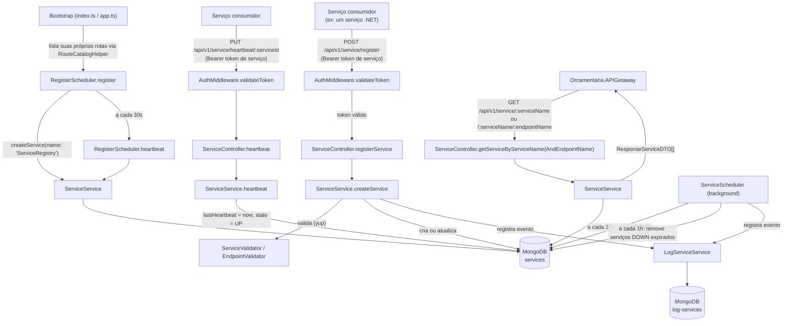
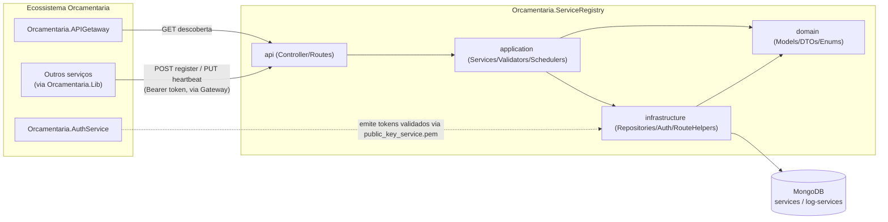
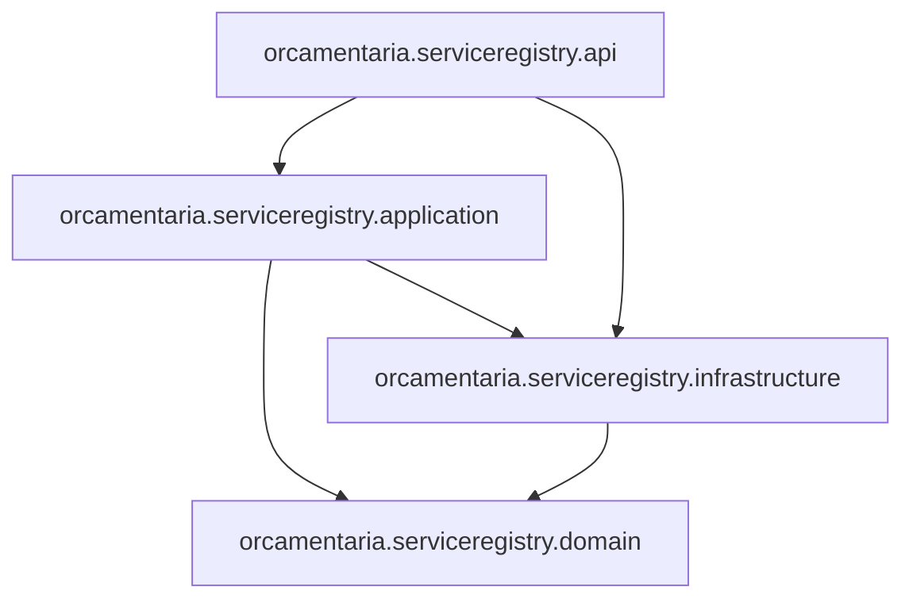

# 🧭 Orcamentaria.ServiceRegistry

Service Registry do ecossistema de microsserviços **Orcamentaria**, responsável por permitir que os serviços se **auto-registrem** com seus endpoints, mantenham sua disponibilidade via **heartbeat** periódico e sejam **descobertos** por nome/endpoint pelo `Orcamentaria.APIGetaway` e demais consumidores.

---

## 🎯 Objetivo

Em uma arquitetura de microsserviços, o Gateway e os próprios serviços não podem depender de endereços fixos configurados manualmente para se encontrarem. O `Orcamentaria.ServiceRegistry` resolve isso centralizando o cadastro e o ciclo de vida das instâncias:

1. Cada serviço se registra informando **nome**, **baseUrl** e a lista de **endpoints** expostos;
2. O serviço envia **heartbeat** periódico para sinalizar que continua saudável;
3. Se o heartbeat parar de chegar por tempo suficiente, o serviço é marcado como indisponível e, depois de um período adicional, removido do registro;
4. Consumidores (principalmente o `Orcamentaria.APIGetaway`) consultam o registro por **nome de serviço** (e, opcionalmente, **nome de endpoint**) para descobrir onde e como chamar a instância correspondente.

O próprio `Orcamentaria.ServiceRegistry` se registra nele mesmo na inicialização, como se fosse mais um serviço do ecossistema (`name: "ServiceRegistry"`), tornando-se descobrível pelo Gateway da mesma forma que qualquer outro serviço.

---

## 🧰 Tecnologias

| Tecnologia | Versão (package.json) | Finalidade |
|---|---|---|
| Node.js / TypeScript | `typescript ^5.8.3` | Linguagem e tipagem estática |
| Express | `^5.1.0` | Servidor HTTP e roteamento |
| MongoDB (driver oficial `mongodb`) | `^6.21.0` | Persistência de serviços registrados e logs |
| Awilix | `^12.0.5` | Container de Injeção de Dependência |
| jsonwebtoken | `^9.0.2` | Validação de token JWT (RS256) nas rotas protegidas |
| yup | `^1.6.1` | Validação de schema dos modelos antes da persistência |
| dayjs | `^1.11.13` | Manipulação de datas (heartbeat, expiração) |
| dotenv | `^16.5.0` | Carregamento de variáveis de ambiente a partir do `.env` |
| cors | `^2.8.5` | Middleware de CORS |
| ts-node | `^10.9.2` | Execução direta do TypeScript (usado pelo script `start`) |

---

## 🏗️ Arquitetura

O projeto segue uma organização em camadas dentro de `src/`, com nomes de pasta que espelham o padrão usado nos serviços .NET do ecossistema (`api`, `application`, `domain`, `infrastructure`), adaptado a Node/TypeScript:

- **`orcamentaria.serviceregistry.domain`**: modelos (`ServiceModel`, `EndpointModel`, `LogServiceModel`, `ResponseModel`, `ResponseError`), DTOs (`CreateServiceDTO`, `CreateEndpointDTO`, `ResponseServiceDTO`, `ResponseEndpointDTO`) e enums (`StateEnum`, `HttpMethodEnum`, `LogTypeEnum`, `ResponseErrorEnum`). Sem dependência de Express ou Mongo.
- **`orcamentaria.serviceregistry.application`**: regras de negócio — `ServiceService` (registro, descoberta, heartbeat), `LogServiceService` (auditoria), validadores baseados em `yup` (`ServiceValidator`, `EndpointValidator`) e os *schedulers* de background (`RegisterScheduler`, `ServiceScheduler`).
- **`orcamentaria.serviceregistry.infrastructure`**: acesso a dados (`MongoContext`, `ServiceRepository`, `LogServiceRepository`), middleware de autenticação (`AuthMiddleware`) e helpers de roteamento (`RouteHelper`, `RouteCatalogHelper`).
- **`orcamentaria.serviceregistry.api`**: composição da aplicação Express (`app.ts`), container de DI (`di.ts`), controller (`ServiceController`) e definição das rotas (`ServiceRoute`).

A composição (`di.ts`) registra todas as dependências via Awilix e conecta ao MongoDB antes de resolver os demais serviços; `app.ts` monta o Express, registra as rotas sob `/api/v1/service` e inicia os *schedulers* de saúde e de auto-registro.

---

## 📁 Estrutura do Projeto

```text
Orcamentaria.ServiceRegistry/
├── index.ts                                    # Bootstrap: carrega .env, cria o app e sobe o servidor HTTP
├── public_key_service.pem                      # Chave pública RS256 usada para validar tokens de serviço
├── src/
│   ├── orcamentaria.serviceregistry.api/
│   │   ├── app.ts                              #   Monta o Express, resolve o container e inicia os schedulers
│   │   ├── di.ts                                #   Configuração do container Awilix (conexão Mongo incluída)
│   │   ├── controllers/ServiceController.ts     #   Handlers HTTP (descoberta, registro, heartbeat)
│   │   └── routes/ServiceRoute.ts               #   Declaração das rotas de /api/v1/service
│   ├── orcamentaria.serviceregistry.application/
│   │   ├── services/ServiceService.ts           #   Regras de registro, atualização, descoberta e heartbeat
│   │   ├── services/LogServiceService.ts        #   Registro de auditoria (log-services)
│   │   ├── validators/ServiceValidator.ts       #   Validação (yup) do ServiceModel antes de inserir
│   │   ├── validators/EndpointValidator.ts      #   Validação (yup) de cada EndpointModel
│   │   └── schedulers/
│   │       ├── RegisterScheduler.ts             #   Auto-registro do próprio ServiceRegistry e seu heartbeat
│   │       └── ServiceScheduler.ts              #   Marca serviços como DOWN e remove os expirados
│   ├── orcamentaria.serviceregistry.domain/
│   │   ├── models/*.ts                          #   ServiceModel, EndpointModel, LogServiceModel, ResponseModel...
│   │   ├── dtos/*.ts                            #   CreateServiceDTO, CreateEndpointDTO, ResponseServiceDTO...
│   │   └── enums/*.ts                           #   StateEnum, HttpMethodEnum, LogTypeEnum, ResponseErrorEnum
│   └── orcamentaria.serviceregistry.infrastructure/
│       ├── contexts/MongoContext.ts             #   Conexão com o MongoDB (driver oficial)
│       ├── repositories/ServiceRepository.ts    #   CRUD e consultas de serviços na coleção "services"
│       ├── repositories/LogServiceRepository.ts #   Persistência de logs na coleção "log-services"
│       ├── helpers/RouteHelper.ts               #   Registra rotas no Express e as cataloga
│       ├── helpers/RouteCatalogHelper.ts        #   Catálogo estático de todas as rotas registradas
│       └── midlewares/AuthMidleware.ts          #   Validação de JWT RS256 (token de serviço)
├── tsconfig.json
└── package.json
```

---

## 🔄 Fluxo da Aplicação



**Passo a passo:**
1. Na subida, o próprio `ServiceRegistry` monta suas rotas (`ServiceRoute`) e, através de `RouteCatalogHelper`, obtém a lista de rotas registradas para se auto-cadastrar (`RegisterScheduler.register`) com `name: "ServiceRegistry"` e `baseUrl` vindo de `SELF_URL` (ou `http://localhost:${PORT}` como *fallback*). Rotas que casem com os padrões `/favicon.ico`, `/health`, `/metrics` ou `/swagger*` são ignoradas nesse auto-cadastro.
2. A partir daí, o próprio processo dispara seu heartbeat internamente a cada 30 segundos, chamando `ServiceService.heartbeat` diretamente (sem passar por HTTP).
3. Outros serviços do ecossistema chamam `POST /api/v1/service/register` (autenticado) informando `name`, `baseUrl` e `endpoints`; `ServiceService.createService` valida os dados com `yup`, cria um novo documento ou atualiza um serviço já existente com o mesmo `name`+`baseUrl`, e grava um log de auditoria (`CREATED`/`UPDATED`).
4. Periodicamente, cada serviço registrado chama `PUT /api/v1/service/heartbeat/:serviceId` (autenticado) para atualizar `lastHeartbeat` e marcar o estado como `UP`.
5. Consumidores — normalmente o `Orcamentaria.APIGetaway` — consultam `GET /api/v1/service/:serviceName` (todos os endpoints) ou `GET /api/v1/service/:serviceName/:endpointName` (um endpoint específico) para descobrir a `baseUrl` e a rota a chamar.
6. Em segundo plano, `ServiceScheduler.healthServiceValidate` roda a cada 30 segundos e marca como `DOWN` qualquer serviço `UP`/`STARTING` cujo `lastHeartbeat` esteja mais antigo que `MAX_LIFE_TIME` minutos, registrando o evento (`UPDATED`) no log.
7. `ServiceScheduler.removeServices` roda a cada 1 hora e remove definitivamente do MongoDB os serviços `DOWN` cujo `lastHeartbeat` esteja mais antigo que `BURIAL_TIME` minutos, registrando o evento (`DELETED`) no log.

---

## ⚙️ Configuração

A aplicação carrega variáveis de ambiente via `dotenv` (`import "dotenv/config"` em `index.ts`), lidas a partir de um arquivo `.env` na raiz do projeto.

A conexão com o MongoDB é feita em `di.ts`, que instancia `MongoContext` com `MONGO_URI`/`MONGO_DB` e conecta ao banco antes de qualquer outra dependência ser resolvida.

O middleware de autenticação (`AuthMiddleware`) lê a chave pública `public_key_service.pem`, localizada na raiz do projeto (resolvida via `process.cwd()`), usada para validar tokens JWT assinados com RS256.

---

## 🔑 Variáveis de Ambiente

| Variável | Descrição |
|---|---|
| `MONGO_URI` | String de conexão do MongoDB usada por `MongoContext`. |
| `MONGO_DB` | Nome do banco de dados MongoDB utilizado. |
| `PORT` | Porta HTTP em que o Express escuta (`index.ts` usa `3000` como *fallback* caso não definida). |
| `SELF_URL` | `baseUrl` que o próprio `ServiceRegistry` usa ao se auto-registrar (`app.ts`); se ausente, usa `http://localhost:${PORT}`. |
| `MAX_LIFE_TIME` | Tempo máximo (em minutos) sem heartbeat antes de um serviço `UP`/`STARTING` ser marcado `DOWN` (`ServiceScheduler.healthServiceValidate`); *fallback* `1.5` se não definida. |
| `BURIAL_TIME` | Tempo máximo (em minutos) que um serviço pode permanecer `DOWN` antes de ser removido definitivamente (`ServiceScheduler.removeServices`); *fallback* `720` se não definida. |

---

## ▶️ Como Executar

### Pré-requisitos
- Node.js
- Uma instância MongoDB acessível (local ou Atlas), com `MONGO_URI`/`MONGO_DB` configurados
- Arquivo `public_key_service.pem` presente na raiz do projeto (chave pública RS256 do emissor de tokens de serviço, `orcamentaria.auth`)
- Arquivo `.env` na raiz com, no mínimo, `MONGO_URI`, `MONGO_DB` e `PORT`

### Passo a passo

```bash
git clone <url-do-repositorio>
cd Orcamentaria.ServiceRegistry

npm install

npm start
```

O script `start` (`package.json`) executa `ts-node index.ts` diretamente, sem etapa de compilação. O servidor sobe em `http://localhost:${PORT}` (ou `3000` se `PORT` não estiver definida) e, na subida, já dispara o auto-registro do `ServiceRegistry` no próprio banco.

---

## 🧭 APIs

### Endpoints

Base path: `/api/v1/service`

| Método | Rota | Autenticação | Descrição |
|---|---|---|---|
| `GET` | `/api/v1/service/:serviceName/:endpointName` | Pública | Retorna o serviço pelo nome, com apenas o endpoint solicitado (`ResponseServiceDTO[]` com `endpoints` filtrado). |
| `GET` | `/api/v1/service/:serviceName` | Pública | Retorna todas as instâncias registradas com esse nome, com todos os endpoints. |
| `POST` | `/api/v1/service/register` | Bearer (token de serviço) | Registra um novo serviço ou atualiza um já existente com o mesmo `name`+`baseUrl`. Corpo: `{ name, baseUrl, endpoints: [{ name, method, route }] }`. |
| `PUT` | `/api/v1/service/heartbeat/:serviceId` | Bearer (token de serviço) | Atualiza `lastHeartbeat` e marca o serviço como `UP`. Retorna `NotFound` se nenhum documento for modificado. |

Todas as respostas seguem o formato `ResponseModel`: `{ Data, Success, Message?, Error? }`, e os controllers sempre retornam HTTP `200` — o resultado real da operação (sucesso, validação falhou, não encontrado etc.) é expresso no corpo, via `Success` e `Error.ErrorCode`/`Error.ErrorName`.

---

## 🔗 Integrações

| Integração | Descrição |
|---|---|
| **MongoDB** | Persistência dos serviços registrados (coleção `services`) e do histórico de auditoria (coleção `log-services`), via `MongoContext`. |
| **Orcamentaria.APIGetaway** | Consulta `GET /api/v1/service/:serviceName` e `GET /api/v1/service/:serviceName/:endpointName` para descobrir instâncias e endpoints antes de rotear uma chamada. |
| **Serviços do ecossistema (via `Orcamentaria.Lib`)** | Serviços construídos sobre `Orcamentaria.Lib.Application.HostedServices.ServiceRegistryHostedService` se registram e enviam heartbeat chamando o Gateway com `ServiceName: "ServiceRegistry"` e `EndpointName: "ServiceRegister"`/`"ServiceHeartbeat"`, que por sua vez chegam a este serviço como `POST /register` e `PUT /heartbeat/:serviceId`. |
| **Orcamentaria.AuthService** | Emissor dos tokens JWT RS256 (`issuer: orcamentaria.auth`) validados pelo `AuthMiddleware` nas rotas de registro e heartbeat. |

---

## 📈 Logs

Não há uma biblioteca de logging estruturado configurada; o processo usa `console.log` para a mensagem de subida do servidor (`index.ts`) e para erros inesperados capturados em `ServiceService.heartbeat`.

Além disso, o serviço mantém um **log de auditoria persistido** em MongoDB (`LogServiceService` → `LogServiceRepository`, coleção `log-services`), registrando eventos de `CREATED`, `UPDATED` e `DELETED` sobre cada serviço — incluindo o registro/atualização de serviços, a transição para `DOWN` por expiração de heartbeat e a remoção definitiva após o tempo de sepultamento, cada um com o estado anterior (`updateBefore`) e posterior (`updateAfter`).

---

## 🚨 Tratamento de Erros

As camadas de `application` (`ServiceService`, `LogServiceService`) capturam exceções em blocos `try/catch` e retornam um `ResponseModel` com `Success: false` e um `ResponseError` cujo `ErrorCode`/`ErrorName` vem de `ResponseErrorEnum` (`ValidationFailed`, `NotFound`, `AccessDenied`, `Conflict`, `InternalError`, etc.). A validação de schema (`yup`) é aplicada antes da persistência em `ServiceValidator`/`EndpointValidator`, retornando a primeira mensagem de erro encontrada.

O `AuthMiddleware` responde com `ResponseModel` contendo `ErrorCode: AccessDenied` quando o header `Authorization` está ausente ou quando a verificação do JWT falha (assinatura inválida, `issuer`/`audience` incorretos ou token expirado).

---

## 🔐 Segurança

A autenticação de serviço usa **JWT assinado com RS256**, validado por `AuthMiddleware` com a chave pública `public_key_service.pem` (lida da raiz do projeto), exigindo `issuer: "orcamentaria.auth"` e `audience: "orcamentaria.service"`. O *claim* `name` do token é usado para preencher `req.params.serviceName` na requisição autenticada.

As rotas de escrita (`POST /register` e `PUT /heartbeat/:serviceId`) exigem esse token via header `Authorization: Bearer <token>`. As rotas de descoberta (`GET /:serviceName` e `GET /:serviceName/:endpointName`) são públicas, permitindo que o Gateway (e outros consumidores) resolvam endereços sem precisar de credenciais.

---

## 🧩 Padrões Encontrados

| Padrão | Onde aparece |
|---|---|
| **Dependency Injection** | Container Awilix (`di.ts`) registrando repositórios, validadores, serviços, controller e *schedulers*. |
| **Repository** | `ServiceRepository` e `LogServiceRepository` encapsulam o acesso ao MongoDB. |
| **DTO** | `CreateServiceDTO`/`CreateEndpointDTO` (entrada) e `ResponseServiceDTO`/`ResponseEndpointDTO` (saída) desacoplam os modelos de domínio dos contratos HTTP. |
| **Validator dedicado (yup)** | `ServiceValidator` e `EndpointValidator` validam os modelos antes da persistência. |
| **Response Wrapper** | `ResponseModel`/`ResponseError` padronizam toda resposta da API com `Success`/`Error`. |
| **Scheduler / Background Job** | `RegisterScheduler` (auto-registro e heartbeat próprios) e `ServiceScheduler` (expiração e remoção) rodam via `setInterval`. |
| **Route Catalog / Self-Registration** | `RouteCatalogHelper` cataloga as rotas registradas em `CreateNamedRoutes`, reaproveitadas por `RegisterScheduler` para o serviço se auto-descrever ao se registrar. |

---

## 📊 Diagrama de Arquitetura



---

## 🧱 Dependências entre Módulos



---

## 📝 Resumo Executivo

O **Orcamentaria.ServiceRegistry** é o serviço de descoberta do ecossistema Orcamentaria, construído em Node.js/TypeScript com Express, MongoDB e Awilix para injeção de dependência. Ele expõe rotas de descoberta públicas (`GET /api/v1/service/:serviceName` e `GET /api/v1/service/:serviceName/:endpointName`) e rotas autenticadas por JWT RS256 para registro (`POST /api/v1/service/register`) e heartbeat (`PUT /api/v1/service/heartbeat/:serviceId`).

O ciclo de vida de um serviço registrado passa pelos estados `STARTING → UP → DOWN`, controlado por dois *schedulers* de background: um que marca serviços como `DOWN` quando o heartbeat expira (`MAX_LIFE_TIME`) e outro que remove definitivamente os serviços `DOWN` após o tempo de sepultamento (`BURIAL_TIME`). O próprio `ServiceRegistry` se auto-registra na inicialização, cadastrando suas próprias rotas e enviando seu próprio heartbeat internamente, tornando-se descobrível pelo `Orcamentaria.APIGetaway` como qualquer outro serviço do ecossistema. Toda alteração relevante (criação, atualização, expiração e remoção) é registrada em um log de auditoria persistido em uma coleção separada no MongoDB.
